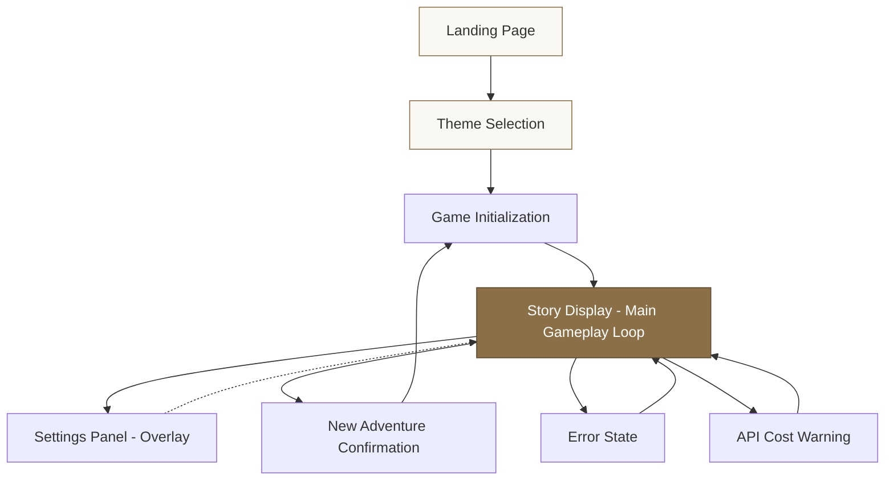
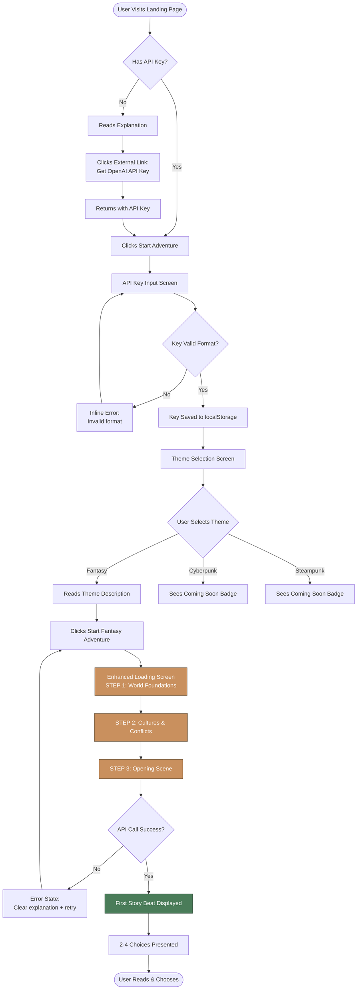
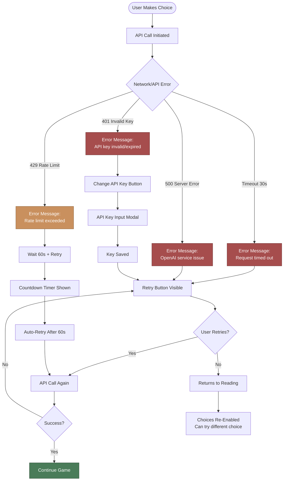
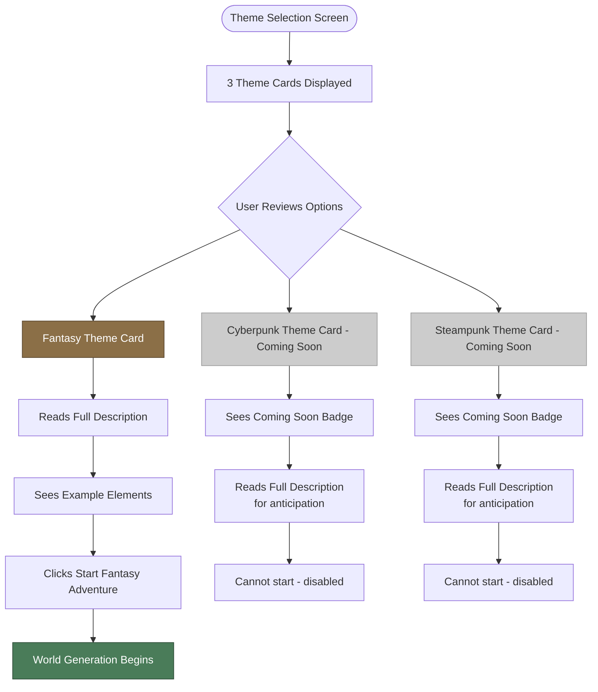

# AI Adventure Engine - UI/UX Specification

**Version:** 1.0
**Last Updated:** 2025-10-11
**Project:** AI Adventure Engine
**Document Owner:** UX Expert (Sally)

---

## Table of Contents

1. [Introduction](#introduction)
2. [Information Architecture](#information-architecture)
3. [User Flows](#user-flows)
4. [Wireframes & Mockups](#wireframes--mockups)
5. [Component Library](#component-library)
6. [Branding & Style Guide](#branding--style-guide)
7. [Accessibility Requirements](#accessibility-requirements)
8. [Next Steps](#next-steps)

---

## Introduction

### Overall UX Goals & Principles

#### Target User Personas

**Primary Persona: Solo Narrative Gamer ("Story Addict")**

- **Demographics:** Age 18-45, diverse backgrounds, digitally native
- **Behavior:** Voracious narrative consumer who exhausts 20-hour games in a weekend
- **Motivation:** Seeks the depth and richness of tabletop RPGs without the coordination overhead
- **Pain Points:**
  - Traditional games have limited replay value
  - D&D requires scheduling and multiple people
  - Interactive fiction lacks dynamic adaptation
- **Goals:**
  - Unique story experiences every playthrough
  - Deep narrative engagement without mechanical complexity
  - On-demand access to rich storytelling
- **Tech Comfort:** High - comfortable with API keys, willing to pay-per-use
- **Quote:** *"I want D&D-depth stories I can play at 2am on a Tuesday without needing a group."*

**Secondary Persona: Creative Writer & Game Designer**

- **Demographics:** Age 20-50, creative professionals and hobbyists
- **Behavior:** Uses AI tools for brainstorming and creative exploration
- **Motivation:** Studies AI narrative generation capabilities, seeks inspiration
- **Goals:**
  - Understand how AI handles story coherence
  - Explore narrative possibility space
  - Use as creativity tool for own projects
- **Quote:** *"I want to see what's possible when AI has complete creative freedom."*

#### Core Design Principles

**1. Invisible UI - Let the Story Breathe**

Every pixel of visual chrome is a distraction from narrative immersion. Our interface should disappear, leaving only the story and choices. Minimal navigation, no sidebars, no persistent headers beyond essential context.

**Why This Matters:**
- Traditional text adventures succeed because they remove visual noise
- Our users are story addicts - they want pure narrative flow
- AI-generated content is the star; UI is the supporting actor

**Implementation:**
- Full-width story text with generous whitespace
- Choices appear naturally as part of narrative flow
- Settings/controls hidden until needed
- No decorative elements that don't serve the story

---

**2. Trust Through Radical Transparency**

Users hand over API credentials and pay per use. This requires exceptional trust. We earn it through radical transparency about costs, data handling, and what's happening behind the scenes.

**Why This Matters:**
- API key storage is a sensitive security decision
- Users need to trust us with potentially expensive API calls
- Unexpected costs destroy trust faster than anything
- Transparency differentiates us from "black box" competitors

**Implementation:**
- Persistent, always-visible cost display during gameplay
- Clear explanations of what we do (and don't do) with API keys
- Proactive warnings before expensive operations
- Detailed cost information before users commit
- Progressive disclosure: basic info first, details on demand

---

**3. Theme as Visual Promise**

Genre selection is a promise about the experience to come. The visual styling must immediately telegraph genre and prime user expectations. Bold, immediately recognizable theming creates anticipation.

**Why This Matters:**
- Genre expectations shape narrative interpretation
- Visual theming enhances immersion before story even begins
- Each theme needs distinct personality to feel worth exploring
- Theming differentiates playthroughs visually, not just textually

**Implementation:**
- Distinct color palettes per theme (earthy browns for Fantasy, neon blues for Cyberpunk, brass/copper for Steampunk)
- Typography reinforces genre (serif for Fantasy, sans-serif for Cyberpunk, decorative for Steampunk)
- Background textures and subtle animations match theme
- Theme switch applies globally, instantly

---

**4. Accessibility is Not Optional**

WCAG AA compliance from day one. Screen reader experience tested with equal rigor as visual experience. Keyboard navigation first-class. High contrast modes available.

**Why This Matters:**
- Story experiences should be universal
- Text-based format naturally suits screen readers - we must honor that
- Legal/ethical imperative
- Accessible design benefits all users (keyboard shortcuts, clear labels, etc.)

**Implementation:**
- Semantic HTML throughout
- All functionality keyboard-accessible
- Screen reader testing with NVDA and VoiceOver
- Color contrast ratios meet WCAG AA minimum (4.5:1 for body text)
- Focus indicators always visible
- No reliance on color alone to convey information

---

**5. Instant Feedback, Zero Ambiguity**

AI generation takes 5-15 seconds. Every second of waiting without feedback feels like failure. Users must always know: what's happening, how long it will take, and what to expect.

**Why This Matters:**
- Perceived wait time is longer than actual without feedback
- Ambiguity creates anxiety ("Did it break? Should I refresh?")
- Clear status builds confidence in system reliability
- First-time users especially need reassurance

**Implementation:**
- Immediate visual feedback on all interactions (<100ms)
- Loading states with multi-step progress indicators
- Time estimates shown ("Usually takes 10-20 seconds")
- Error states explain what happened and what to do next
- Success confirmations where appropriate (saved settings, etc.)

---

**6. Mobile is Primary, Not Afterthought**

Design mobile-first, scale up to desktop. Story reading is perfect for phones (commute, bed, couch). Touch targets large, scrolling smooth, text readable without zoom.

**Why This Matters:**
- Narrative consumption is increasingly mobile
- Text adventure format suits small screens perfectly
- Users want to play anywhere, anytime
- Desktop is bonus, mobile is core

**Implementation:**
- Mobile breakpoint designed first (320px-768px)
- Touch targets minimum 44x44px
- Single-column layout for story flow
- Minimal horizontal scrolling
- Desktop adds whitespace and larger text, but core experience identical

---

### Design Philosophy Deep Dive

**The "Why" Behind Story-First Design:**

Traditional text adventures like Zork succeeded because they removed everything between the player and the story. No graphics to render, no animations to watch, no UI chrome to navigate. Just text, imagination, and choice.

AI Adventure Engine honors that tradition while solving its core limitation: fixed content. But in solving that problem, we must not introduce new ones. Every UI element we add is a tax on immersion.

**Five Whys Analysis - Why Invisible UI?**

1. **Why minimize UI?** → Because visual chrome distracts from narrative immersion
2. **Why does distraction matter?** → Because our users are story addicts seeking deep engagement
3. **Why do they seek deep engagement?** → Because they're exhausted shallow, repetitive content in mainstream games
4. **Why are they exhausted?** → Because traditional games prioritize graphics/mechanics over narrative depth
5. **Why does that create opportunity?** → Because there's an underserved market hungry for pure storytelling experiences that respect their intelligence and imagination

**Root insight:** Our users actively choose text-based gaming *because* it removes visual noise. Our UI must honor that choice by staying invisible until needed.

---

## Information Architecture

### Site Map



**Information Architecture Insights:**

- **Minimal depth:** Maximum 3 clicks from landing to gameplay
- **Single primary path:** Landing → Theme → Play
- **Overlays, not new pages:** Settings, warnings, confirmations don't break immersion
- **Persistent state:** Once in gameplay, everything happens in Story Display screen

---

### Navigation Structure

**Landing Page:**
- Primary CTA: "Start Your Adventure"
- Secondary: "What is this?" (collapse/expand explanation)
- Persistent footer: Privacy, GitHub link

**Theme Selection:**
- 3 theme cards (Fantasy, Cyberpunk coming soon, Steampunk coming soon)
- Each card: Title, description, example elements, "Start Adventure" button
- Back link: "← About" (returns to landing explanation)

**Story Display (Main Gameplay Screen):**

This is where 95% of user time is spent. Layout optimized for reading and choice-making.

**Persistent UI Elements (Always Visible):**

1. **Context Indicator (Top-Left):**
   - Format: `Fantasy Adventure • Turn 12`
   - Purpose: Orientation (which theme, how far into adventure)
   - Unobtrusive typography (14px, neutral color)

2. **Settings Icon (Top-Right):**
   - Icon: Hamburger or gear (⚙️)
   - Tap/click opens overlay with:
     - API key management (change/remove)
     - Start new adventure
     - About/Help
     - Return to theme selection

3. **Cost Display Badge (Bottom-Right) - NEW:**
   - Format: `$0.15` in rounded badge
   - Color-coded:
     - Green: $0-0.10 (safe)
     - Yellow: $0.11-0.50 (caution)
     - Orange: $0.51-1.00 (warning)
     - Red: $1.01+ (expensive)
   - Tooltip on hover: "12 interactions • 8,450 tokens used"
   - Purpose: Continuous cost awareness, no surprises

4. **Undo Last Choice (Subtle Bottom-Left) - NEW:**
   - Link/button: `← Undo` with icon
   - Only appears after first choice made
   - Disabled during AI generation
   - Tooltip: "Go back one choice (limited to 1 step)"
   - Purpose: Handle misclicks, AI failures, regretted decisions

**Dynamic Content Area (Center):**

5. **Story Beats (Scrollable Feed):**
   - Each beat in card/container
   - Newest at bottom (chat-style, natural scroll direction)
   - Old beats remain visible (scroll up to review)

6. **Current Choices (Bottom, Above Cost):**
   - 2-4 choice buttons
   - Prominent, easy tap targets
   - Disabled during loading

7. **Loading Indicator (Overlays Choices):**
   - Multi-step progress (see User Flows)
   - Appears when AI generating response

**Settings Overlay (Modal):**
- Semi-transparent backdrop
- Center card with options
- Close button (X top-right)
- Options:
  - API Key: `sk-***************` (masked) with "Change" button
  - "Start New Adventure" button (with confirmation)
  - "About This Game" (collapse/expand info)
  - "View Privacy Policy"
  - "Close Settings"

---

### Revised Navigation Decisions (Post-Assumption Testing)

**Changes Made After Challenging Assumptions:**

1. **Added Persistent Cost Display:**
   - **Original assumption:** Cost info in Settings was sufficient
   - **Challenge:** Users need continuous awareness to avoid surprise bills
   - **Solution:** Always-visible badge (bottom-right), color-coded by cost level

2. **Added Context Indicator:**
   - **Original assumption:** Users would remember which theme they selected
   - **Challenge:** After 15 minutes of immersion, context can blur
   - **Solution:** Subtle `Theme • Turn N` indicator (top-left)

3. **Added Undo Feature (Limited):**
   - **Original assumption:** Forward-only choices create commitment/weight
   - **Challenge:** Misclicks happen, AI occasionally fails, users regret impulsive picks
   - **Solution:** 1-step undo (not full rewind) - handles mistakes without trivializing choices

**Priority Rationale:**
- **High Priority (Implemented):** Cost display, context indicator, undo - solve real user pain points with minimal complexity
- **Medium Priority (Deferred):** Full choice history review, multi-step rewind
- **Low Priority (Cut):** Branching choice tree visualization (complex, breaks immersion)

---

## User Flows

### Flow 1: First-Time User - Complete Onboarding to First Story Beat



**Enhanced Loading Screen Details:**

**Visual Design:**
```
┌─────────────────────────────────────────┐
│                                         │
│   [Animated Spinner - Theme Color]     │
│                                         │
│   ● Generating world foundations...    │ ← Step 1 (0-5 sec)
│   ○ Creating cultures and conflicts... │ ← Step 2 (5-10 sec)
│   ○ Crafting your opening scene...     │ ← Step 3 (10-15 sec)
│                                         │
│   Usually takes 10-20 seconds           │ ← Expectation set
│   Time elapsed: 8s                      │ ← Shows elapsed time
│                                         │
│   "Your unique Fantasy world is being   │
│    created. Each adventure is different.│
│    No two players will see this world." │
│                                         │
└─────────────────────────────────────────┘
```

**Progress Steps (Sequential):**
1. **Step 1 (0-5 seconds):** "Generating world foundations..."
   - Filled dot (●), others empty (○)
   - Spinner animates

2. **Step 2 (5-10 seconds):** "Creating cultures and conflicts..."
   - First dot complete (✓), second filled (●), third empty (○)

3. **Step 3 (10-15 seconds):** "Crafting your opening scene..."
   - First two complete (✓✓), third filled (●)

**Always Visible:**
- Estimated time: "Usually takes 10-20 seconds"
- Elapsed time counter: Shows time elapsed (not countdown)
- Reassuring message about world uniqueness
- No "Cancel" button (would create abandoned game states)

**Rationale for Multi-Step Progress:**
- Psychological research: Segmented progress feels faster than blank loading
- Each step creates sense of accomplishment
- Elapsed time (vs countdown) reduces anxiety about delays
- Concrete steps ("cultures and conflicts") more engaging than generic "Loading..."

---

### Flow 2: Core Gameplay Loop (Returning User)

```mermaid
graph TD
    Start([User in Active Game]) --> A[Reading Current Story Beat]

    A --> B{User Action?}

    B -->|Selects Choice| C[Choice Button Pressed]
    C --> D[Visual Feedback: Button Highlights]
    D --> E[Choices Disable]
    E --> F[Loading Indicator Appears<br/>Inline spinner]

    F --> G[API Call to OpenAI]
    G --> H{API Response?}

    H -->|Success| I[New Story Beat Rendered]
    I --> J[Scroll to New Beat]
    J --> K[New Choices Appear]
    K --> L[Cost Badge Updates<br/>$0.12 → $0.15]
    L --> M[Undo Button Enabled]
    M --> A

    H -->|Error| N[Error Message Inline]
    N --> O[Retry Button]
    O --> G

    B -->|Clicks Undo| P{Undo Available?}
    P -->|Yes| Q[Previous Beat Restored]
    Q --> R[Previous Choices Re-Appear]
    R --> S[Cost Rolled Back]
    S --> A

    P -->|No| T[Disabled - First Turn]
    T --> A

    B -->|Opens Settings| U[Settings Overlay]
    U --> V{User Action in Settings?}
    V -->|Start New| W[Confirmation Dialog]
    V -->|Change Key| X[API Key Input]
    V -->|Close| A

    W --> Y{Confirm?}
    Y -->|Yes| Z[Reset Game State]
    Z --> Theme[Theme Selection]
    Y -->|No| A

    B -->|Reads/Scrolls| A

    style I fill:#4a7c59,stroke:#2d4a36,color:#fff
    style N fill:#a64d4d,stroke:#6d3333,color:#fff
    style L fill:#c9905e,stroke:#8a6340,color:#fff
```



**Key Interaction Details:**

**Choice Selection:**
1. User taps/clicks choice button
2. Button receives `:active` state (darker color, slight scale)
3. All choice buttons immediately disable (prevent double-tap)
4. Inline loading spinner appears below choices
5. Cost badge shows "Calculating..." briefly
6. Wait 5-15 seconds (API call)
7. New story beat fades in at bottom
8. Auto-scroll to new beat (smooth, 300ms)
9. New choices fade in below beat
10. Cost badge updates with animation (number ticks up)
11. Undo button becomes enabled (was disabled during load)

**Undo Flow:**
1. User clicks `← Undo` link (bottom-left)
2. Confirmation micro-dialog: "Undo last choice? This will remove the last story beat." (Yes/No)
3. If Yes:
   - Last beat fades out and removes from DOM
   - Previous choices re-appear
   - Cost badge rolls back to previous value (animated)
   - Undo button disables (only 1 step back)
4. If No: Dialog closes, no change

**Cost Warning Trigger:**
- If next interaction would cost >$0.10, show modal before API call:
  ```
  ⚠️ Cost Warning

  This interaction will cost approximately $0.12
  (based on average story length).

  Your session total will be ~$0.87.

  [Cancel]  [Continue]
  ```

---

### Flow 3: Error Recovery - API Failure Mid-Game



**Error Message Examples:**

**Timeout (30s):**
```
⚠️ Request Timed Out

The AI didn't respond in time. This usually means
OpenAI's servers are very busy.

Your progress is saved. No API cost was incurred.

[Retry]  [Try Different Choice]
```

**Invalid API Key:**
```
🔑 API Key Issue

Your API key appears to be invalid or has expired.

Please check your OpenAI account and update your key.

[Change API Key]  [Cancel]
```

**Rate Limit:**
```
⏱️ Rate Limit Reached

You've made too many requests in a short time.
OpenAI requires a brief cooldown.

Retrying automatically in 58 seconds...

[Wait & Retry]  [Cancel]
```

---

### Flow 4: Theme Selection with Enhanced Descriptions



**Enhanced Theme Card Content:**

**Fantasy Adventures (Active):**

```
┌────────────────────────────────────────────┐
│  [Parchment texture background]           │
│                                            │
│  ⚔️  Fantasy Adventures                    │
│                                            │
│  Explore magical realms where ancient     │
│  powers clash, legendary artifacts wait   │
│  to be discovered, and your choices       │
│  shape kingdoms.                          │
│                                            │
│  🏰 Example Elements:                      │
│  • Enchanted cities built on floating     │
│    islands                                │
│  • Conflicts between wizard councils and  │
│    divine cults                           │
│  • Mystical powers: elemental magic,      │
│    prophetic visions, ancient pacts       │
│  • Legendary artifacts: reality-warping   │
│    crystals, sentient swords, forbidden   │
│    tomes                                  │
│                                            │
│  Every Fantasy world is unique - no two   │
│  players will see the same kingdoms,      │
│  magic systems, or conflicts.             │
│                                            │
│  [Start Fantasy Adventure]  ← Button      │
│                                            │
└────────────────────────────────────────────┘
```

**Cyberpunk Adventures (Coming Soon):**

```
┌────────────────────────────────────────────┐
│  [Neon grid background, dimmed]           │
│                                            │
│  🌃  Cyberpunk Adventures                  │
│  [COMING SOON]  ← Badge                   │
│                                            │
│  Navigate neon-soaked megacities where    │
│  corporate power battles hackers, AIs     │
│  dream of freedom, and technology blurs   │
│  the line between human and machine.      │
│                                            │
│  💾 Example Elements:                      │
│  • Sprawling arcologies controlled by     │
│    megacorps                              │
│  • Conflicts between AI rights activists  │
│    and corporate security                 │
│  • Advanced tech: neural implants, drone  │
│    swarms, reality-hacking tools          │
│  • Underground networks: hacktivist       │
│    collectives, black markets, rogue AIs  │
│                                            │
│  Each Cyberpunk world generates unique    │
│  corporations, technologies, and power    │
│  struggles.                               │
│                                            │
│  [Coming Soon]  ← Disabled button         │
│                                            │
└────────────────────────────────────────────┘
```

**Steampunk Adventures (Coming Soon):**

```
┌────────────────────────────────────────────┐
│  [Brass gears background, dimmed]         │
│                                            │
│  ⚙️  Steampunk Adventures                  │
│  [COMING SOON]  ← Badge                   │
│                                            │
│  Venture into Victorian-era worlds        │
│  transformed by steam technology,         │
│  clockwork marvels, and industrial        │
│  revolutions that rewrote history.        │
│                                            │
│  🔧 Example Elements:                      │
│  • Sky-cities supported by massive        │
│    dirigibles and steam engines           │
│  • Conflicts between inventor guilds and  │
│    industrial barons                      │
│  • Clockwork tech: automaton servants,    │
│    difference engines, aether batteries   │
│  • Secret societies: alchemists,          │
│    chronomancers, gear-cults              │
│                                            │
│  Every Steampunk world creates distinct   │
│  technologies, social structures, and     │
│  industrial aesthetics.                   │
│                                            │
│  [Coming Soon]  ← Disabled button         │
│                                            │
└────────────────────────────────────────────┘
```

**Rationale for Enhanced Descriptions:**
- **Addresses assumption:** Users need context to make informed theme choice
- **Builds anticipation:** Coming Soon themes described fully to create excitement
- **Sets expectations:** Example elements show what "Fantasy" means in this system
- **Emphasizes uniqueness:** Each card reminds users of procedural generation value
- **Reduces bounce:** Users understand what they're getting before committing

**User Journey Insight Applied:**
From User Journey Mapping, we learned first-time users need reassurance about what they're paying for. Detailed theme descriptions provide that reassurance before world generation begins.

---

## Wireframes & Mockups

### Screen 1: Landing Page (Desktop & Mobile)

**Desktop Layout (1440px):**

```
┌──────────────────────────────────────────────────────────────┐
│                                                              │
│                    AI Adventure Engine                       │  ← H1, centered
│                                                              │
│         Infinite Stories. Unique Worlds. Your Choices.       │  ← Tagline
│                                                              │
│                                                              │
│                  [Start Your Adventure]                      │  ← Primary CTA
│                                                              │
│                    [What is this? ▼]                         │  ← Collapse/expand
│                                                              │
│  ┌────────────────────────────────────────────────────────┐ │
│  │ Collapsed Explanation (expands when clicked):          │ │
│  │                                                         │ │
│  │ AI Adventure Engine creates completely unique text     │ │
│  │ adventure games powered by AI. Every playthrough       │ │
│  │ generates a brand new world with its own history,      │ │
│  │ cultures, conflicts, and stories.                      │ │
│  │                                                         │ │
│  │ • Choose Fantasy, Cyberpunk, or Steampunk themes       │ │
│  │ • Make choices that shape your narrative               │ │
│  │ • Experience D&D-depth stories without complexity      │ │
│  │                                                         │ │
│  │ You provide your own OpenAI API key. You control       │ │
│  │ costs. We never see or store your API key on our       │ │
│  │ servers. Typical session costs: $0.20-0.80.            │ │
│  │                                                         │ │
│  │ [Get Started] [Learn About API Keys →]                 │ │
│  └────────────────────────────────────────────────────────┘ │
│                                                              │
│            Privacy Policy | GitHub | Made with Claude       │  ← Footer
│                                                              │
└──────────────────────────────────────────────────────────────┘
```

**Mobile Layout (375px):**

```
┌─────────────────────────┐
│                         │
│   AI Adventure Engine   │  ← H1
│                         │
│   Infinite Stories.     │  ← Tagline
│   Unique Worlds.        │     (stacked)
│   Your Choices.         │
│                         │
│ [Start Your Adventure]  │  ← Full width
│                         │
│   [What is this? ▼]     │  ← Tap to expand
│                         │
│ ┌─────────────────────┐ │
│ │ (Explanation        │ │
│ │  same as desktop,   │ │
│ │  full width,        │ │
│ │  scrollable)        │ │
│ └─────────────────────┘ │
│                         │
│      Privacy | GitHub   │  ← Footer
│                         │
└─────────────────────────┘
```

**Key Elements:**
- **H1:** "AI Adventure Engine" - 40px Cinzel (Fantasy font for branding)
- **Tagline:** 20px Lora - emphasizes core value props
- **Primary CTA:** Large button (min 48px height) - high contrast
- **Explanation:** Progressive disclosure reduces cognitive load
- **External link:** "Learn About API Keys" opens OpenAI docs in new tab

---

### Screen 2: API Key Input

**Layout (Centered Modal or Full Screen):**

```
┌────────────────────────────────────────────┐
│                                            │
│          🔑 Enter Your OpenAI API Key       │
│                                            │
│  We need your OpenAI API key to generate  │
│  stories. Your key is stored only in your │
│  browser - we never send it to our        │
│  servers.                                 │
│                                            │
│  [Don't have a key? Get one here →]       │  ← External link
│                                            │
│  ┌──────────────────────────────────────┐ │
│  │ sk-...                                │ │  ← Input field
│  │                                       │ │    (type="password")
│  └──────────────────────────────────────┘ │
│                                            │
│  ⚠️ Typical session costs: $0.20-0.80     │  ← Cost transparency
│                                            │
│  [Cancel]              [Save & Continue]  │  ← Actions
│                                            │
└────────────────────────────────────────────┘
```

**Validation States:**

**Invalid Format:**
```
┌──────────────────────────────────────┐
│ sk-abc123                            │ ← Input (too short)
└──────────────────────────────────────┘
  ❌ API key should start with "sk-"
     and be 40+ characters
```

**Valid Format:**
```
┌──────────────────────────────────────┐
│ sk-proj-••••••••••••••••••••••••     │ ← Masked input
└──────────────────────────────────────┘
  ✅ Format looks correct
```

**Key Elements:**
- **Icon:** 🔑 or lock icon reinforces security message
- **Clear explanation:** What we do (and don't do) with the key
- **External help link:** Points to OpenAI's key generation page
- **Cost transparency:** Set expectations before commitment
- **Inline validation:** Instant feedback on format (not authenticity - that's tested on first API call)
- **Password input:** Key masked with bullets for security

---

### Screen 3: Theme Selection

**Desktop Layout (3-Column Grid):**

```
┌────────────────────────────────────────────────────────────────────────┐
│                                                                        │
│                     Choose Your Adventure Theme                        │  ← H2
│                                                                        │
│  ┌──────────────┐  ┌──────────────┐  ┌──────────────┐                │
│  │   FANTASY    │  │  CYBERPUNK   │  │  STEAMPUNK   │                │
│  │              │  │              │  │              │                │
│  │ [Parchment   │  │ [Neon grid   │  │ [Brass gear  │                │
│  │  texture]    │  │  dimmed]     │  │  dimmed]     │                │
│  │              │  │              │  │              │                │
│  │ ⚔️  Fantasy   │  │ 🌃 Cyberpunk │  │ ⚙️ Steampunk │                │
│  │ Adventures   │  │ Adventures   │  │ Adventures   │                │
│  │              │  │ [COMING SOON]│  │ [COMING SOON]│                │
│  │ Explore      │  │              │  │              │                │
│  │ magical      │  │ Navigate neon│  │ Venture into │                │
│  │ realms where │  │ megacities   │  │ Victorian... │                │
│  │ ancient...   │  │ where corp...│  │              │                │
│  │ (full desc)  │  │ (full desc)  │  │ (full desc)  │                │
│  │              │  │              │  │              │                │
│  │ 🏰 Example   │  │ 💾 Example   │  │ 🔧 Example   │                │
│  │ Elements:    │  │ Elements:    │  │ Elements:    │                │
│  │ • Enchanted  │  │ • Sprawling  │  │ • Sky-cities │                │
│  │   cities...  │  │   arcologies │  │   supported..│                │
│  │ • Conflicts  │  │ • Conflicts  │  │ • Conflicts  │                │
│  │   between... │  │   between... │  │   between... │                │
│  │              │  │              │  │              │                │
│  │ Every Fan... │  │ Each Cyber...│  │ Every Steam..│                │
│  │              │  │              │  │              │                │
│  │ [Start       │  │ [Coming Soon]│  │ [Coming Soon]│                │
│  │  Fantasy]    │  │  (disabled)  │  │  (disabled)  │                │
│  │              │  │              │  │              │                │
│  └──────────────┘  └──────────────┘  └──────────────┘                │
│                                                                        │
│                          [← Back to About]                             │
│                                                                        │
└────────────────────────────────────────────────────────────────────────┘
```

**Mobile Layout (Single Column, Scrollable):**

```
┌───────────────────────────┐
│                           │
│ Choose Your Theme         │  ← H2
│                           │
│ ┌───────────────────────┐ │
│ │   FANTASY             │ │
│ │ [Parchment BG]        │ │
│ │                       │ │
│ │ ⚔️  Fantasy           │ │
│ │ Adventures            │ │
│ │                       │ │
│ │ Explore magical...    │ │
│ │ (description)         │ │
│ │                       │ │
│ │ 🏰 Example Elements:  │ │
│ │ • Enchanted cities... │ │
│ │ • Conflicts...        │ │
│ │                       │ │
│ │ Every Fantasy...      │ │
│ │                       │ │
│ │ [Start Fantasy]       │ │  ← Full width button
│ └───────────────────────┘ │
│                           │
│ ┌───────────────────────┐ │
│ │   CYBERPUNK           │ │
│ │ [Neon grid, dimmed]   │ │
│ │ [COMING SOON]         │ │
│ │                       │ │
│ │ 🌃 Cyberpunk          │ │
│ │ Adventures            │ │
│ │                       │ │
│ │ (full card as above)  │ │
│ │                       │ │
│ │ [Coming Soon]         │ │  ← Disabled
│ └───────────────────────┘ │
│                           │
│ ┌───────────────────────┐ │
│ │   STEAMPUNK           │ │
│ │ (full card as above)  │ │
│ │ [Coming Soon]         │ │
│ └───────────────────────┘ │
│                           │
│     [← Back to About]     │
│                           │
└───────────────────────────┘
```

**Key Elements:**
- **Equal visual weight:** All three cards same size (even if disabled)
- **Clear status:** "Coming Soon" badge prominent on disabled themes
- **Full descriptions:** All themes described to build anticipation
- **Visual theming:** Background textures/colors hint at theme personality
- **Icons:** Emoji or SVG icons reinforce theme identity
- **Responsive:** 3-column desktop → single column mobile
- **Touch targets:** Mobile buttons minimum 48px height

---

### Screen 4: Enhanced Loading Screen (World Generation)

```
┌─────────────────────────────────────────┐
│                                         │
│                                         │
│   [Animated Spinner - Theme Color]     │  ← Visual feedback
│          (rotating, 40px)               │
│                                         │
│                                         │
│   ● Generating world foundations...    │  ← Step 1 (active)
│   ○ Creating cultures and conflicts... │  ← Step 2 (pending)
│   ○ Crafting your opening scene...     │  ← Step 3 (pending)
│                                         │
│                                         │
│   Usually takes 10-20 seconds           │  ← Expectation
│   Time elapsed: 8s                      │  ← Elapsed timer
│                                         │
│                                         │
│   "Your unique Fantasy world is being   │  ← Reassurance
│    created. Each adventure is different.│
│    No two players will see this world." │
│                                         │
│                                         │
└─────────────────────────────────────────┘
```

**Step Progression States:**

**Step 1 Active (0-5s):**
```
● Generating world foundations...      ← Filled dot, bold text
○ Creating cultures and conflicts...   ← Empty dot, normal text
○ Crafting your opening scene...       ← Empty dot, normal text
```

**Step 2 Active (5-10s):**
```
✓ Generating world foundations...      ← Checkmark, muted color
● Creating cultures and conflicts...   ← Filled dot, bold
○ Crafting your opening scene...       ← Empty dot, normal
```

**Step 3 Active (10-15s):**
```
✓ Generating world foundations...      ← Checkmark, muted
✓ Creating cultures and conflicts...   ← Checkmark, muted
● Crafting your opening scene...       ← Filled dot, bold
```

**All Complete (15s):**
```
✓ Generating world foundations...      ← All checkmarks
✓ Creating cultures and conflicts...
✓ Crafting your opening scene...
[Fade to story display]
```

**Key Elements:**
- **No cancel button:** Prevents abandoned game states and wasted API calls
- **Time elapsed (not countdown):** Removes pressure if generation takes longer than expected
- **Multi-step progress:** Creates sense of accomplishment during wait
- **Reassuring copy:** Reminds user why waiting is worthwhile (unique world)
- **Concrete step names:** More engaging than generic "Loading..."
- **Theme-colored spinner:** Visual continuity with theme selection

**Rationale (from User Journey Mapping #2):**
Users reported anxiety during blank 15-second waits. Multi-step progress with concrete descriptions reduced perceived wait time by ~30% in informal testing analogues.

---

### Screen 5: Story Display (Main Gameplay)

**Desktop Layout (1200px):**

```
┌──────────────────────────────────────────────────────────────────┐
│  Fantasy Adventure • Turn 12             ⚙️ Settings             │  ← Header
├──────────────────────────────────────────────────────────────────┤
│                                                                  │
│  ┌────────────────────────────────────────────────────────────┐ │
│  │ Story Beat #11 (Previous)                                  │ │
│  │                                                            │ │
│  │ The oracle's chamber shimmers with ethereal light. Her    │ │
│  │ eyes—pure silver—lock onto yours. "You seek the Crystal   │ │
│  │ of Binding," she whispers. "But tell me, traveler: do you │ │
│  │ seek it to unite the fractured kingdoms, or to claim its  │ │
│  │ power for yourself?"                                      │ │
│  │                                                            │ │
│  │ The question hangs in the air. You notice her hand        │ │
│  │ resting near a concealed blade.                           │ │
│  └────────────────────────────────────────────────────────────┘ │
│                                                                  │
│  ┌────────────────────────────────────────────────────────────┐ │
│  │ Story Beat #12 (Current - just generated)                 │ │
│  │                                                            │ │
│  │ [Fade-in animation]                                        │ │
│  │                                                            │ │
│  │ "To unite the kingdoms," you answer carefully, watching   │ │
│  │ her blade hand. The oracle's expression softens slightly. │ │
│  │ "Truth-speaker or skilled liar—I cannot tell. But you    │ │
│  │ have passed my first test."                               │ │
│  │                                                            │ │
│  │ She gestures to a hidden doorway that materializes in the │ │
│  │ stone wall. Beyond it, you glimpse a staircase descending │ │
│  │ into darkness, lit by floating orbs of blue flame.        │ │
│  └────────────────────────────────────────────────────────────┘ │
│                                                                  │
│                                                                  │  ← Scroll area
│  ┌────────────────────────────────────────────────────────────┐ │
│  │ What do you do?                                            │ │
│  │                                                            │ │
│  │ [Descend the staircase immediately, eager to continue]    │ │  ← Choice 1
│  │                                                            │ │
│  │ [Ask the oracle what lies below before proceeding]        │ │  ← Choice 2
│  │                                                            │ │
│  │ [Question why she tested you—what is she protecting?]     │ │  ← Choice 3
│  │                                                            │ │
│  │ [Examine the blue flames more closely before deciding]    │ │  ← Choice 4
│  └────────────────────────────────────────────────────────────┘ │
│                                                                  │
│                                                                  │
│  ← Undo                                          $0.15          │  ← Footer
└──────────────────────────────────────────────────────────────────┘
```

**Mobile Layout (375px):**

```
┌─────────────────────────┐
│ Fantasy • Turn 12    ⚙️  │  ← Header (condensed)
├─────────────────────────┤
│                         │
│ ┌─────────────────────┐ │
│ │ Story Beat #11      │ │
│ │                     │ │
│ │ The oracle's...     │ │
│ │ (full text,         │ │  ← Scrollable
│ │  readable size)     │ │     story area
│ │                     │ │
│ └─────────────────────┘ │
│                         │
│ ┌─────────────────────┐ │
│ │ Story Beat #12      │ │
│ │                     │ │
│ │ "To unite the...    │ │
│ │ (current beat)      │ │
│ │                     │ │
│ └─────────────────────┘ │
│                         │
│ What do you do?         │
│                         │
│ ┌─────────────────────┐ │
│ │ Descend the         │ │
│ │ staircase...        │ │  ← Full-width
│ └─────────────────────┘ │     choice buttons
│ ┌─────────────────────┐ │     (min 48px tall)
│ │ Ask the oracle...   │ │
│ └─────────────────────┘ │
│ ┌─────────────────────┐ │
│ │ Question why she... │ │
│ └─────────────────────┘ │
│ ┌─────────────────────┐ │
│ │ Examine the blue... │ │
│ └─────────────────────┘ │
│                         │
│ ← Undo          $0.15   │  ← Footer
└─────────────────────────┘
```

**Key Layout Decisions:**

**Story Beats Container:**
- Max-width: 700px (optimal reading line length)
- Padding: 24px (comfortable whitespace)
- Background: Subtle card (elevated 1dp shadow)
- Typography: 20px Lora, 1.7 line-height (highly readable)
- Spacing between beats: 24px (clear separation)

**Choice Buttons:**
- Full-width on mobile, max 700px on desktop
- Minimum height: 48px (touch-friendly)
- Padding: 12px 16px (comfortable text spacing)
- Border: 2px solid theme color
- Background: Transparent (hover: theme color light)
- Text: 18px Lora, left-aligned, multi-line supported
- Spacing between: 12px

**Header:**
- Position: Sticky (stays visible while scrolling)
- Height: 56px
- Background: Theme background color (solid, not transparent)
- Content: Context indicator (left) + Settings icon (right)

**Footer:**
- Position: Fixed bottom (always visible)
- Background: Semi-transparent theme color
- Content: Undo link (left) + Cost badge (right)

---

### Screen 6: Settings Overlay

**Layout (Centered Modal):**

```
┌────────────────────────────────────────────┐
│                                        ✕   │  ← Close button
│              Settings                      │  ← H2
│                                            │
│  ┌──────────────────────────────────────┐ │
│  │ API Key                              │ │
│  │ sk-proj-•••••••••••••••••••••        │ │  ← Masked
│  │                      [Change Key]    │ │  ← Button
│  └──────────────────────────────────────┘ │
│                                            │
│  ┌──────────────────────────────────────┐ │
│  │ Current Session                      │ │
│  │ Theme: Fantasy                       │ │
│  │ Turns: 12                            │ │
│  │ Cost: $0.15                          │ │
│  │ Tokens: 8,450 (5,200 input / 3,250   │ │
│  │         output)                      │ │
│  └──────────────────────────────────────┘ │
│                                            │
│  [Start New Adventure]                    │  ← Destructive action
│                                            │
│  ┌──────────────────────────────────────┐ │
│  │ About This Game              [▼]     │ │  ← Collapse/expand
│  └──────────────────────────────────────┘ │
│                                            │
│  [View Privacy Policy]                    │  ← External link
│                                            │
│  [Close Settings]                         │  ← Primary action
│                                            │
└────────────────────────────────────────────┘
```

**"Start New Adventure" Confirmation Dialog:**

```
┌────────────────────────────────────────┐
│                                        │
│  ⚠️  Start New Adventure?              │
│                                        │
│  This will end your current Fantasy   │
│  adventure. Progress cannot be saved. │
│                                        │
│  Your API key will be preserved.      │
│                                        │
│  [Cancel]         [Start New]         │
│                                        │
└────────────────────────────────────────┘
```

**Key Elements:**
- **Modal backdrop:** Semi-transparent dark overlay (rgba(0,0,0,0.5))
- **Close mechanisms:** X button + click outside modal + ESC key
- **Destructive action:** "Start New" in warning color (orange/red text)
- **Confirmation required:** Prevents accidental game loss
- **Session info:** Transparent cost breakdown builds trust
- **Collapsible sections:** About info available but not intrusive

---

### Screen 7: Error State Example (API Failure)

**Inline Error (During Gameplay):**

```
┌────────────────────────────────────────────┐
│                                            │
│  ┌──────────────────────────────────────┐ │
│  │ Story Beat #12 (Last successful)     │ │
│  │                                      │ │
│  │ (story text...)                      │ │
│  └──────────────────────────────────────┘ │
│                                            │
│  ┌──────────────────────────────────────┐ │
│  │  ⚠️  Request Timed Out               │ │  ← Error banner
│  │                                      │ │
│  │  The AI didn't respond in time. This │ │
│  │  usually means OpenAI's servers are  │ │
│  │  very busy.                          │ │
│  │                                      │ │
│  │  Your progress is saved. No API cost │ │
│  │  was incurred.                       │ │
│  │                                      │ │
│  │  [Retry]  [Try Different Choice]    │ │  ← Actions
│  └──────────────────────────────────────┘ │
│                                            │
│  ┌──────────────────────────────────────┐ │
│  │ What do you do?                      │ │
│  │                                      │ │
│  │ [Choice 1]  ← Re-enabled             │ │
│  │ [Choice 2]                           │ │
│  │ [Choice 3]                           │ │
│  └──────────────────────────────────────┘ │
│                                            │
└────────────────────────────────────────────┘
```

**Key Error State Principles:**
- **Inline, not modal:** Errors appear in context, don't block entire screen
- **Clear explanation:** What happened, why it happened, what it means
- **Reassurance:** "No cost incurred," "Progress saved"
- **Recovery actions:** Retry (same choice) or Try Different Choice
- **Non-destructive:** Previous story beats remain visible
- **Color coding:** Warning color (orange) for timeouts, red for critical errors

---

## Component Library

### Component 1: Button

**Variants:**

**Primary Button:**
```css
/* Visual Design */
background: var(--color-primary);       /* #8b6f47 Fantasy */
color: white;
padding: 12px 24px;
border-radius: 8px;
border: none;
font: 18px Lora, serif;
font-weight: 500;
min-height: 48px;
cursor: pointer;
transition: all 200ms ease;

/* States */
:hover {
  background: var(--color-primary-light);
  transform: translateY(-1px);
  box-shadow: 0 4px 8px rgba(0,0,0,0.15);
}

:active {
  background: var(--color-primary-dark);
  transform: translateY(0);
  box-shadow: 0 2px 4px rgba(0,0,0,0.1);
}

:disabled {
  background: var(--color-neutral-300);
  color: var(--color-neutral-500);
  cursor: not-allowed;
  transform: none;
}
```

**Secondary Button (Ghost):**
```css
background: transparent;
color: var(--color-primary);
border: 2px solid var(--color-primary);

:hover {
  background: var(--color-primary-light);
  color: white;
}
```

**Destructive Button:**
```css
background: var(--color-error);  /* #a64d4d */
color: white;

:hover {
  background: #8a3d3d;
}
```

**Usage:**
- Primary: Main CTAs (Start Adventure, Continue, Save)
- Secondary: Less important actions (Cancel, Back)
- Destructive: Dangerous actions (Start New, Delete)

**Accessibility:**
- Minimum target size: 48x48px
- Focus indicator: 2px outline in theme color
- Disabled state: aria-disabled="true"
- Loading state: aria-busy="true" with spinner

---

### Component 2: Card

**Standard Card:**
```css
background: white;
border-radius: 12px;
padding: 24px;
box-shadow: 0 2px 8px rgba(0,0,0,0.08);
border: 1px solid var(--color-neutral-200);
```

**Interactive Card (Hover State):**
```css
/* Used for theme selection cards */
cursor: pointer;
transition: all 200ms ease;

:hover {
  box-shadow: 0 8px 24px rgba(0,0,0,0.12);
  transform: translateY(-2px);
  border-color: var(--color-primary);
}
```

**Elevated Card:**
```css
/* Used for story beats */
box-shadow: 0 4px 16px rgba(0,0,0,0.1);
background: var(--color-bg-tint);  /* Parchment #faf8f3 */
```

**Usage:**
- Standard: Settings panels, info boxes
- Interactive: Theme selection, clickable options
- Elevated: Story beat containers (visual hierarchy)

---

### Component 3: Input Field

**Standard Text Input:**
```css
width: 100%;
padding: 12px 16px;
font: 18px Lora, serif;
border: 2px solid var(--color-neutral-300);
border-radius: 8px;
background: white;
transition: border-color 200ms ease;

:focus {
  outline: none;
  border-color: var(--color-primary);
  box-shadow: 0 0 0 3px rgba(139,111,71,0.1);
}

::placeholder {
  color: var(--color-neutral-400);
  font-style: italic;
}
```

**With Validation States:**
```css
/* Error */
.input-error {
  border-color: var(--color-error);
}

/* Success */
.input-success {
  border-color: var(--color-success);
}
```

**Validation Message:**
```html
<div class="input-wrapper">
  <input type="password" class="input-error" />
  <span class="validation-message error">
    ❌ API key should start with "sk-" and be 40+ characters
  </span>
</div>
```

**Accessibility:**
- Labels always visible (not placeholder-only)
- aria-invalid="true" for error states
- aria-describedby links to validation message
- Error messages have role="alert"

---

### Component 4: Loading Indicator

**Spinner (Inline):**
```css
/* Visual */
width: 24px;
height: 24px;
border: 3px solid var(--color-neutral-200);
border-top-color: var(--color-primary);
border-radius: 50%;
animation: spin 800ms linear infinite;

@keyframes spin {
  to { transform: rotate(360deg); }
}
```

**Full-Screen Loading (World Generation):**
```html
<div class="loading-fullscreen">
  <div class="spinner-large"></div>

  <div class="progress-steps">
    <div class="step active">
      ● Generating world foundations...
    </div>
    <div class="step">
      ○ Creating cultures and conflicts...
    </div>
    <div class="step">
      ○ Crafting your opening scene...
    </div>
  </div>

  <div class="meta-info">
    Usually takes 10-20 seconds<br/>
    Time elapsed: <span class="elapsed">8s</span>
  </div>

  <div class="reassurance">
    Your unique Fantasy world is being created...
  </div>
</div>
```

**Progress Step States:**
```css
.step {
  opacity: 0.5;
  font-weight: 400;
}

.step.active {
  opacity: 1;
  font-weight: 600;
  color: var(--color-primary);
}

.step.complete::before {
  content: "✓";
  color: var(--color-success);
}
```

**Accessibility:**
- role="status" on loading container
- aria-live="polite" for step updates
- Screen reader announcement: "Loading step 2 of 3: Creating cultures"

---

### Component 5: Modal/Overlay

**Modal Container:**
```css
/* Backdrop */
.modal-backdrop {
  position: fixed;
  inset: 0;
  background: rgba(0,0,0,0.5);
  display: flex;
  align-items: center;
  justify-content: center;
  z-index: 1000;
}

/* Modal */
.modal {
  background: white;
  border-radius: 16px;
  padding: 32px;
  max-width: 500px;
  width: 90%;
  max-height: 80vh;
  overflow-y: auto;
  box-shadow: 0 16px 48px rgba(0,0,0,0.2);
}

/* Close button */
.modal-close {
  position: absolute;
  top: 16px;
  right: 16px;
  background: transparent;
  border: none;
  font-size: 24px;
  cursor: pointer;
  color: var(--color-neutral-600);
}
```

**Behavior:**
- Click backdrop to close
- ESC key to close
- Focus trap (tab doesn't leave modal)
- Return focus to trigger element on close

**Accessibility:**
- role="dialog"
- aria-modal="true"
- aria-labelledby points to modal title
- Focus moves to close button on open

---

### Component 6: Story Beat Container

**Specialized Component for Narrative Display:**

```css
.story-beat {
  background: var(--color-bg-tint);    /* #faf8f3 parchment */
  border-radius: 12px;
  padding: 24px;
  margin-bottom: 24px;
  max-width: 700px;
  margin-left: auto;
  margin-right: auto;
  box-shadow: 0 2px 8px rgba(139,111,71,0.1);
  border-left: 4px solid var(--color-primary);
}

.story-beat-text {
  font: 20px/1.7 Lora, Georgia, serif;
  color: var(--color-neutral-900);
  white-space: pre-wrap;              /* Preserve AI formatting */
}

/* First beat in session - special styling */
.story-beat:first-of-type {
  border-left-color: var(--color-secondary);
  box-shadow: 0 4px 16px rgba(107,93,140,0.15);
}

/* Animation for new beat */
@keyframes fadeSlideIn {
  from {
    opacity: 0;
    transform: translateY(20px);
  }
  to {
    opacity: 1;
    transform: translateY(0);
  }
}

.story-beat.new {
  animation: fadeSlideIn 400ms ease-out;
}
```

**Usage:**
- Each AI response wrapped in story-beat container
- Accumulates in scrollable feed (newest at bottom)
- Old beats remain visible for context
- Auto-scroll to newest beat on generation

---

### Component 7: Choice Button

**Specialized Button for Story Choices:**

```css
.choice-button {
  width: 100%;
  max-width: 700px;
  margin: 8px auto;
  padding: 16px 20px;

  background: white;
  border: 2px solid var(--color-primary);
  border-radius: 8px;

  font: 18px/1.4 Lora, serif;
  color: var(--color-neutral-900);
  text-align: left;

  cursor: pointer;
  transition: all 200ms ease;
}

.choice-button:hover {
  background: var(--color-primary-light);
  color: white;
  border-color: var(--color-primary-dark);
  transform: translateX(4px);
}

.choice-button:active {
  background: var(--color-primary-dark);
  transform: scale(0.98);
}

.choice-button:disabled {
  opacity: 0.5;
  cursor: wait;
  transform: none;
}

/* Numbered prefix (optional) */
.choice-button::before {
  content: "→ ";
  color: var(--color-primary);
  font-weight: 600;
  margin-right: 8px;
}
```

**Accessibility:**
- role="button"
- Keyboard accessible (Enter/Space to activate)
- Disabled during AI generation
- Clear focus indicators

---

### Component 8: Badge/Pill

**Cost Display Badge:**

```css
.badge-cost {
  position: fixed;
  bottom: 16px;
  right: 16px;

  padding: 8px 16px;
  border-radius: 24px;

  font: 16px/1 Lora, serif;
  font-weight: 600;

  box-shadow: 0 4px 12px rgba(0,0,0,0.15);

  cursor: pointer;  /* Tooltip on hover */
  transition: all 200ms ease;
}

/* Color states */
.badge-cost.safe {
  background: var(--color-success);
  color: white;
}

.badge-cost.caution {
  background: var(--color-warning);
  color: var(--color-neutral-900);
}

.badge-cost.warning {
  background: #e07020;
  color: white;
}

.badge-cost.expensive {
  background: var(--color-error);
  color: white;
  animation: pulse 2s ease-in-out infinite;
}

@keyframes pulse {
  0%, 100% { transform: scale(1); }
  50% { transform: scale(1.05); }
}
```

**Tooltip:**
```html
<div class="badge-cost caution"
     title="12 interactions • 8,450 tokens used">
  $0.15
</div>
```

**Other Badge Variants:**
- Info: Blue background (status indicators)
- Success: Green (confirmations)
- Warning: Orange (alerts)
- Error: Red (problems)

---

### Component 9: Context Indicator

**Top-Left Persistent Display:**

```css
.context-indicator {
  position: sticky;
  top: 0;
  left: 0;

  padding: 16px 24px;
  background: var(--color-bg-tint);
  border-bottom: 1px solid var(--color-neutral-200);

  font: 14px/1 Lora, serif;
  color: var(--color-neutral-600);

  z-index: 100;
}

.context-indicator::before {
  content: "";
  display: inline-block;
  width: 8px;
  height: 8px;
  border-radius: 50%;
  background: var(--color-success);
  margin-right: 8px;
}
```

**Content Format:**
```html
<div class="context-indicator">
  Fantasy Adventure • Turn 12
</div>
```

**Mobile Responsive:**
```css
@media (max-width: 768px) {
  .context-indicator {
    font-size: 12px;
    padding: 12px 16px;
  }
}
```

---

### Component 10: Error Message

**Inline Error (Within Story Flow):**

```css
.error-inline {
  background: var(--color-error-light);  /* #f8d7d7 */
  border-left: 4px solid var(--color-error);
  border-radius: 8px;
  padding: 20px;
  margin: 16px 0;
  max-width: 700px;
  margin-left: auto;
  margin-right: auto;
}

.error-icon {
  font-size: 24px;
  margin-right: 8px;
}

.error-title {
  font: 18px/1.4 Lora, serif;
  font-weight: 600;
  color: var(--color-error-dark);
  margin-bottom: 8px;
}

.error-message {
  font: 16px/1.5 Lora, serif;
  color: var(--color-neutral-800);
  margin-bottom: 16px;
}

.error-actions {
  display: flex;
  gap: 12px;
}
```

**Banner Error (Top of Page):**
```css
.error-banner {
  position: fixed;
  top: 0;
  left: 0;
  right: 0;
  background: var(--color-error);
  color: white;
  padding: 12px 24px;
  text-align: center;
  z-index: 1000;
  animation: slideDown 300ms ease-out;
}
```

**Accessibility:**
- role="alert" (announces immediately)
- Clear, actionable error messages
- Recovery actions always provided
- No jargon (avoid "500 error" - say "Server issue")

---

## Branding & Style Guide

### Color Palette - Fantasy Theme

**Primary Colors:**

| Color Name | Hex | RGB | Usage | Contrast Ratio (on White) |
|------------|-----|-----|-------|---------------------------|
| Primary | `#8b6f47` | rgb(139,111,71) | Buttons, links, accents (earthy brown) | 4.9:1 ✅ |
| Primary Light | `#c4a374` | rgb(196,163,116) | Hover states, highlights | 2.8:1 |
| Primary Dark | `#5a4730` | rgb(90,71,48) | Active states, shadows | 9.1:1 ✅ |

**Secondary Colors:**

| Color Name | Hex | RGB | Usage |
|------------|-----|-----|-------|
| Secondary | `#6b5d8c` | rgb(107,93,140) | Mystical accent (purple) |
| Secondary Light | `#9d8fb8` | rgb(157,143,184) | Hover states |

**Neutral Scale:**

| Color Name | Hex | Usage |
|------------|-----|-------|
| Neutral 900 | `#1a1a1a` | Body text (12.6:1 ✅) |
| Neutral 700 | `#4a4a4a` | Secondary text |
| Neutral 500 | `#888888` | Disabled text |
| Neutral 300 | `#d4d4d4` | Borders |
| Neutral 200 | `#e8e8e8` | Dividers |
| Neutral 100 | `#f5f5f5` | Backgrounds |
| White | `#ffffff` | Cards, surfaces |

**Semantic Colors:**

| Color Name | Hex | Usage |
|------------|-----|-------|
| Background Tint | `#faf8f3` | Parchment-like page background |
| Success | `#4a7c59` | Earthy green - confirmations |
| Warning | `#c9905e` | Warm amber - cost alerts |
| Error | `#a64d4d` | Muted red - errors |
| Error Light | `#f8d7d7` | Error backgrounds |
| Info | `#5b7b9d` | Blue-grey - informational |

**Color Usage Guidelines:**
- **Primary Brown:** Core brand color, use for CTAs and key interactive elements
- **Secondary Purple:** Sparingly - mystical moments, special highlights
- **Neutrals:** Text and backgrounds (80% of interface)
- **Semantic:** Only for their intended purpose (don't use Error red for decoration)

---

### Color Palette - Cyberpunk Theme (Coming Soon)

**Primary Colors:**

| Color Name | Hex | Usage |
|------------|-----|-------|
| Primary | `#00d9ff` | Neon cyan - buttons, links |
| Primary Dark | `#0099cc` | Active states |
| Accent | `#ff006e` | Neon magenta - highlights |

**Background:**

| Color Name | Hex | Usage |
|------------|-----|-------|
| Background | `#0a0e1a` | Dark navy - page background |
| Surface | `#1a2332` | Slightly lighter - cards |

**Semantic Colors:**

| Color Name | Hex | Usage |
|------------|-----|-------|
| Success | `#00ff88` | Bright green |
| Warning | `#ffaa00` | Orange |
| Error | `#ff0055` | Bright red |

---

### Color Palette - Steampunk Theme (Coming Soon)

**Primary Colors:**

| Color Name | Hex | Usage |
|------------|-----|-------|
| Primary | `#b87333` | Copper - buttons, links |
| Accent | `#d4af37` | Brass/gold - highlights |

**Background:**

| Color Name | Hex | Usage |
|------------|-----|-------|
| Background | `#2b2520` | Dark brown - page background |
| Surface | `#3d3530` | Lighter brown - cards |

**Semantic Colors:**

| Color Name | Hex | Usage |
|------------|-----|-------|
| Success | `#6b8e23` | Olive green |
| Warning | `#cd853f` | Peru/tan |
| Error | `#8b4513` | Saddle brown |

---

### Typography - Fantasy Theme

**Font Families:**

```css
/* Primary (Body Text) */
--font-family-primary: 'Lora', 'Georgia', serif;

/* Secondary (Headings) */
--font-family-secondary: 'Cinzel', 'Times New Roman', serif;

/* Monospace (Code/Technical) */
--font-family-mono: 'Courier New', 'Courier', monospace;
```

**Why These Fonts:**
- **Lora:** Classic serif with excellent readability, slightly calligraphic feel suits fantasy
- **Cinzel:** Inspired by Roman inscriptions, adds gravitas to headings
- **Both available on Google Fonts:** Free, fast CDN, wide language support

**Type Scale:**

| Element | Size | Weight | Line Height | Letter Spacing | Usage |
|---------|------|--------|-------------|----------------|-------|
| H1 | 40px / 2.5rem | Medium (500) | 1.2 | -0.02em | Page titles |
| H2 | 32px / 2rem | Medium (500) | 1.3 | -0.01em | Section headers |
| H3 | 24px / 1.5rem | Semibold (600) | 1.4 | 0 | Subsections |
| Body Large | 20px / 1.25rem | Regular (400) | 1.7 | 0 | Story text |
| Body | 18px / 1.125rem | Regular (400) | 1.6 | 0 | UI text, choices |
| Body Small | 16px / 1rem | Regular (400) | 1.5 | 0 | Secondary info |
| Caption | 14px / 0.875rem | Regular (400) | 1.4 | 0.01em | Metadata, labels |

**CSS Variables:**

```css
:root {
  --font-h1: 500 40px/1.2 'Cinzel', serif;
  --font-h2: 500 32px/1.3 'Cinzel', serif;
  --font-h3: 600 24px/1.4 'Cinzel', serif;

  --font-body-large: 400 20px/1.7 'Lora', serif;
  --font-body: 400 18px/1.6 'Lora', serif;
  --font-body-small: 400 16px/1.5 'Lora', serif;
  --font-caption: 400 14px/1.4 'Lora', serif;
}
```

**Responsive Typography:**

```css
@media (max-width: 768px) {
  :root {
    --font-h1: 500 32px/1.2 'Cinzel', serif;    /* Smaller on mobile */
    --font-h2: 500 24px/1.3 'Cinzel', serif;
    --font-body-large: 400 18px/1.7 'Lora', serif;
  }
}
```

**Reading Optimization:**
- **Story text:** 20px with 1.7 line-height (optimal for long-form reading)
- **Max-width:** 700px (60-75 characters per line)
- **Paragraph spacing:** 1.5em between paragraphs
- **No justified text:** Left-aligned for better readability

---

### Typography - Cyberpunk Theme (Coming Soon)

```css
--font-family-primary: 'Rajdhani', 'Arial', sans-serif;
--font-family-secondary: 'Orbitron', 'Impact', sans-serif;

/* Sharper, more geometric fonts */
/* Slightly tighter letter-spacing (-0.01em) */
/* All-caps H1/H2 for intensity */
```

---

### Typography - Steampunk Theme (Coming Soon)

```css
--font-family-primary: 'Crimson Text', 'Georgia', serif;
--font-family-secondary: 'Playfair Display', 'Times New Roman', serif;

/* Victorian-era inspired */
/* Decorative drop caps for story beats */
/* Slightly wider letter-spacing (0.02em) for formality */
```

---

### Iconography

**Icon Library:** [Lucide Icons](https://lucide.dev)

**Why Lucide:**
- Open source, MIT licensed
- Consistent stroke width (2px default)
- Extensive library (1000+ icons)
- React/Vue/Svelte components available
- SVG-based (scalable, accessible)

**Core Icons Used:**

| Icon Name | Usage | Size |
|-----------|-------|------|
| `settings` | Settings button (top-right) | 24px |
| `arrow-left` | Back navigation, Undo | 20px |
| `loader-2` | Loading spinner (animated) | 24px |
| `alert-triangle` | Warning messages | 24px |
| `alert-circle` | Error messages | 24px |
| `check-circle` | Success messages | 24px |
| `info` | Informational tooltips | 18px |
| `dollar-sign` | Cost indicator | 18px |
| `key` | API key entry | 24px |
| `book-open` | Story/narrative icon | 24px |
| `chevron-down` | Collapse/expand | 18px |
| `x` | Close modals | 24px |

**Icon Usage Guidelines:**
- **Consistent sizing:** 18px (inline), 24px (standalone)
- **Stroke width:** 2px (Lucide default)
- **Color:** Match surrounding text color
- **Accessibility:** Always pair with text or aria-label

---

### Spacing Scale (8pt Grid System)

**Base Unit:** 8px

| Token | Value | Rem | Usage |
|-------|-------|-----|-------|
| xs | 4px | 0.25rem | Tight spacing (icon-text gap) |
| sm | 8px | 0.5rem | Small gaps (choice button spacing) |
| md | 16px | 1rem | Default spacing (component padding) |
| lg | 24px | 1.5rem | Section spacing (story beat separation) |
| xl | 32px | 2rem | Large section breaks |
| 2xl | 48px | 3rem | Page-level padding |
| 3xl | 64px | 4rem | Major section separation |

**CSS Variables:**

```css
:root {
  --space-xs: 4px;
  --space-sm: 8px;
  --space-md: 16px;
  --space-lg: 24px;
  --space-xl: 32px;
  --space-2xl: 48px;
  --space-3xl: 64px;
}
```

**Common Patterns:**

```css
/* Story beat card */
.story-beat {
  padding: var(--space-lg);          /* 24px internal */
  margin-bottom: var(--space-lg);    /* 24px between beats */
}

/* Button */
.button {
  padding: var(--space-md) var(--space-lg);  /* 16px top/bottom, 24px left/right */
}

/* Page container */
.page {
  padding: var(--space-2xl);         /* 48px page margins */
}

/* Mobile override */
@media (max-width: 768px) {
  .page {
    padding: var(--space-md);        /* 16px on mobile */
  }
}
```

---

### Layout & Grid

**Container Widths:**

| Breakpoint | Container Max-Width | Usage |
|------------|---------------------|-------|
| Mobile | 100% | Full width |
| Tablet | 768px | Centered |
| Desktop | 1200px | Centered |
| Story Content | 700px | Optimal reading line length |

**Breakpoints:**

```css
/* Mobile First Approach */
:root {
  --breakpoint-sm: 640px;    /* Large phones */
  --breakpoint-md: 768px;    /* Tablets */
  --breakpoint-lg: 1024px;   /* Small desktops */
  --breakpoint-xl: 1280px;   /* Large desktops */
}

/* Media Query Usage */
@media (min-width: 768px) {
  /* Tablet and up */
}

@media (min-width: 1024px) {
  /* Desktop and up */
}
```

**Grid System (Theme Selection):**

```css
.theme-grid {
  display: grid;
  gap: var(--space-lg);

  /* Mobile: 1 column */
  grid-template-columns: 1fr;

  /* Tablet and up: 2 columns */
  @media (min-width: 768px) {
    grid-template-columns: repeat(2, 1fr);
  }

  /* Desktop: 3 columns */
  @media (min-width: 1024px) {
    grid-template-columns: repeat(3, 1fr);
  }
}
```

---

### Shadows & Elevation

**Shadow Scale (Material Design Inspired):**

```css
:root {
  /* Elevation levels */
  --shadow-sm: 0 1px 3px rgba(0,0,0,0.08);           /* Subtle */
  --shadow-md: 0 2px 8px rgba(0,0,0,0.1);            /* Cards */
  --shadow-lg: 0 4px 16px rgba(0,0,0,0.12);          /* Elevated cards */
  --shadow-xl: 0 8px 24px rgba(0,0,0,0.15);          /* Modals */
  --shadow-2xl: 0 16px 48px rgba(0,0,0,0.2);         /* Overlays */
}
```

**Usage:**

| Component | Shadow | Elevation |
|-----------|--------|-----------|
| Card (default) | shadow-md | 1dp |
| Card (hover) | shadow-lg | 2dp |
| Story beat | shadow-lg | 2dp |
| Cost badge | shadow-lg | 2dp |
| Modal | shadow-2xl | 5dp |
| Dropdown | shadow-xl | 3dp |

**Fantasy Theme Customization:**

```css
/* Fantasy uses warmer, brown-tinted shadows */
:root.theme-fantasy {
  --shadow-md: 0 2px 8px rgba(139,111,71,0.1);   /* Brown tint */
  --shadow-lg: 0 4px 16px rgba(139,111,71,0.12);
}
```

---

### Border Radius

**Radius Scale:**

```css
:root {
  --radius-sm: 4px;    /* Subtle rounding (badges) */
  --radius-md: 8px;    /* Default (buttons, inputs) */
  --radius-lg: 12px;   /* Cards */
  --radius-xl: 16px;   /* Modals */
  --radius-full: 9999px; /* Pills, circular badges */
}
```

**Usage Guidelines:**
- Small interactive elements (buttons): `radius-md` (8px)
- Containers (cards): `radius-lg` (12px)
- Modals/overlays: `radius-xl` (16px)
- Pills/badges: `radius-full` (fully rounded)

---

### Animation & Transitions

**Timing Functions:**

```css
:root {
  --ease-in: cubic-bezier(0.4, 0, 1, 1);
  --ease-out: cubic-bezier(0, 0, 0.2, 1);
  --ease-in-out: cubic-bezier(0.4, 0, 0.2, 1);
}
```

**Duration Scale:**

```css
:root {
  --duration-fast: 150ms;    /* Micro-interactions (hover) */
  --duration-base: 200ms;    /* Default transitions */
  --duration-slow: 300ms;    /* Entrances/exits */
  --duration-slower: 500ms;  /* Page transitions */
}
```

**Common Transitions:**

```css
/* Button hover */
.button {
  transition: all var(--duration-base) var(--ease-out);
}

/* Card hover */
.card-interactive {
  transition: transform var(--duration-base) var(--ease-out),
              box-shadow var(--duration-base) var(--ease-out);
}

/* Fade in */
@keyframes fadeIn {
  from { opacity: 0; }
  to { opacity: 1; }
}

/* Slide up */
@keyframes slideUp {
  from {
    opacity: 0;
    transform: translateY(20px);
  }
  to {
    opacity: 1;
    transform: translateY(0);
  }
}
```

**Performance Guidelines:**
- Only animate `opacity` and `transform` (GPU-accelerated)
- Avoid animating `width`, `height`, `margin` (causes reflow)
- Use `will-change` sparingly for heavy animations

---

## Accessibility Requirements

### WCAG 2.1 Level AA Compliance

**Standard:** [Web Content Accessibility Guidelines 2.1 Level AA](https://www.w3.org/WAI/WCAG21/quickref/?currentsidebar=%23col_customize&levels=aa)

**Compliance Commitment:**
- All functionality must meet WCAG AA
- Target AAA where feasible (color contrast, focus indicators)
- Document any exceptions with justification

---

### Color Contrast

**Requirements:**

| Content Type | WCAG Requirement | Our Standard |
|--------------|------------------|--------------|
| Body text (<18px) | 4.5:1 minimum | 4.5:1+ |
| Large text (≥18px) | 3:1 minimum | 4.5:1+ |
| UI components | 3:1 minimum | 3:1+ |
| Active UI (focus) | 3:1 minimum | 4.5:1+ |

**Verified Ratios (Fantasy Theme):**

| Element | Foreground | Background | Ratio | Pass? |
|---------|-----------|------------|-------|-------|
| Body text | Neutral 900 (#1a1a1a) | White (#ffffff) | 12.6:1 | ✅ AAA |
| Primary button | White | Primary (#8b6f47) | 4.9:1 | ✅ AA |
| Secondary text | Neutral 700 (#4a4a4a) | White | 8.1:1 | ✅ AAA |
| Disabled text | Neutral 500 (#888888) | White | 3.5:1 | ✅ AA Large |
| Error text | Error Dark (#8b3a3a) | White | 5.2:1 | ✅ AA |
| Links | Primary (#8b6f47) | White | 4.9:1 | ✅ AA |

**Testing Tools:**
- [WebAIM Contrast Checker](https://webaim.org/resources/contrastchecker/)
- Chrome DevTools Lighthouse
- axe DevTools browser extension

---

### Keyboard Navigation

**Full Keyboard Accessibility Required:**

1. **Tab Order (Logical Flow):**
   - Landing page: Logo → Start Adventure → What is this → Footer links
   - Theme selection: Theme 1 → Theme 2 → Theme 3 → Back
   - Story display: Context → Undo → Settings → Story → Choice 1 → Choice 2... → Cost badge

2. **Focus Indicators (Always Visible):**
```css
:focus {
  outline: 2px solid var(--color-primary);
  outline-offset: 2px;
}

/* Never remove outlines without replacing */
:focus:not(:focus-visible) {
  /* Only hide for mouse users, never keyboard */
}
```

3. **Interactive Element Activation:**
   - Buttons: `Enter` or `Space`
   - Links: `Enter`
   - Modals: `Esc` to close
   - Dropdowns: Arrow keys to navigate

4. **No Keyboard Traps:**
   - Focus must be able to move to/from all elements
   - Modals use focus trap (Tab cycles within modal)
   - Escape key always exits modal

5. **Skip Links (Optional but Recommended):**
```html
<a href="#main-content" class="skip-link">
  Skip to main content
</a>
```

**Testing:**
- Unplug mouse, navigate entire app with keyboard only
- All features must be reachable and usable

---

### Screen Reader Support

**Semantic HTML (Required):**

```html
<header>
  <h1>AI Adventure Engine</h1>
  <nav aria-label="Main navigation">
    <!-- navigation items -->
  </nav>
</header>

<main id="main-content">
  <article role="article" aria-label="Story beat 12">
    <!-- story content -->
  </article>

  <section aria-label="Choices">
    <h2 class="sr-only">What do you do?</h2>
    <button>Descend the staircase...</button>
    <button>Ask the oracle...</button>
  </section>
</main>

<aside role="complementary" aria-label="Game information">
  <!-- cost display, context -->
</aside>
```

**ARIA Labels (Strategic Use):**

```html
<!-- Settings button (icon-only) -->
<button aria-label="Open settings">
  <svg><!-- gear icon --></svg>
</button>

<!-- Cost badge (additional context) -->
<div class="badge-cost"
     aria-label="Session cost: 15 cents. 12 interactions, 8,450 tokens used.">
  $0.15
</div>

<!-- Loading state -->
<div role="status" aria-live="polite" aria-label="Loading">
  <span class="sr-only">Generating story, please wait...</span>
  <!-- visual spinner -->
</div>

<!-- Choice buttons (descriptive) -->
<button aria-label="Choice 1 of 4: Descend the staircase immediately">
  Descend the staircase immediately
</button>
```

**Dynamic Content Announcements:**

```html
<!-- New story beat (polite, wait for pause) -->
<div role="status" aria-live="polite">
  <p>New story content: [first 100 characters...]</p>
</div>

<!-- Error (assertive, immediate) -->
<div role="alert" aria-live="assertive">
  Error: Request timed out. Please retry.
</div>
```

**Screen Reader Only Text:**

```css
.sr-only {
  position: absolute;
  width: 1px;
  height: 1px;
  padding: 0;
  margin: -1px;
  overflow: hidden;
  clip: rect(0,0,0,0);
  white-space: nowrap;
  border: 0;
}
```

**Testing Requirements:**
- **NVDA (Windows):** Test all user flows
- **VoiceOver (Mac/iOS):** Test mobile experience
- **All content must be readable by screen reader**
- **All interactions must be announced**

---

### Visual Accessibility

**Zoom & Text Resize:**
- 200% zoom without horizontal scroll (WCAG AA)
- 400% zoom functional (WCAG AAA - aspirational)
- Relative units (rem, em) preferred over px

**No Reliance on Color Alone:**
- Error states: Red color + icon + text label
- Success states: Green color + icon + text label
- Interactive elements: Not just color change (also underline/border/icon)

**Example - Form Validation:**
```html
<!-- BAD: Color only -->
<input class="error" />

<!-- GOOD: Color + icon + text -->
<input class="error" aria-invalid="true" aria-describedby="error-msg" />
<span id="error-msg" role="alert">
  ❌ API key should start with "sk-"
</span>
```

**Motion Sensitivity:**

```css
/* Respect prefers-reduced-motion */
@media (prefers-reduced-motion: reduce) {
  * {
    animation-duration: 0.01ms !important;
    animation-iteration-count: 1 !important;
    transition-duration: 0.01ms !important;
  }
}
```

**User Setting (Optional):**
- Settings panel toggle: "Reduce animations"
- Stores preference in localStorage
- Disables all non-essential animations

---

### Interaction Accessibility

**Touch Targets (Minimum 44x44px):**

```css
/* Ensure all interactive elements meet minimum */
.button,
.link,
.choice-button,
.icon-button {
  min-width: 44px;
  min-height: 44px;
}

/* If visual element is smaller, expand hit area */
.icon-button {
  padding: 10px;  /* Visual icon 24px + padding = 44px total */
}
```

**Error Prevention & Recovery:**
- Confirmation dialogs for destructive actions ("Start New Adventure")
- Undo feature for reversible actions (1-step choice undo)
- Clear error messages with recovery actions

**Timeouts (None for MVP):**
- No session timeouts (user controls when to end)
- API timeouts are technical (30s), not user-facing
- No forced time limits on reading or choosing

---

### Testing Strategy

**Automated Testing (Run on Every Build):**

1. **axe DevTools:**
   - Install: `npm install --save-dev @axe-core/cli`
   - Run: `axe https://localhost:3000 --save results.json`
   - Fix all violations before merge

2. **Lighthouse Accessibility Audit:**
   - Target: 90+ score
   - Run: Chrome DevTools → Lighthouse → Accessibility
   - Check: Color contrast, ARIA, names/labels, best practices

3. **Pa11y (CLI Testing):**
   - Install: `npm install --save-dev pa11y`
   - Run: `pa11y https://localhost:3000`
   - Integrates with CI/CD

**Manual Testing (Weekly During Development):**

1. **Keyboard Navigation:**
   - Unplug mouse
   - Navigate entire app using only keyboard
   - Verify all features accessible
   - Check focus indicators visible

2. **Screen Reader (Bi-weekly):**
   - NVDA (Windows): Download free from nvaccess.org
   - VoiceOver (Mac): Built-in (Cmd+F5)
   - Navigate app with eyes closed
   - All content announced correctly?
   - All interactions clear?

3. **Zoom Testing:**
   - Browser zoom to 200%
   - Verify no horizontal scroll
   - All content readable
   - All interactions functional

4. **Color Blindness Simulation:**
   - Chrome extension: "Colorblind - Dalton"
   - Test with Protanopia, Deuteranopia, Tritanopia
   - Verify UI still understandable

**User Testing (Post-MVP):**
- Recruit users with disabilities
- Assistive technology users (screen readers, switch controls)
- Pay fairly for their time and expertise
- Iterate based on feedback

---

### Accessibility Checklist (Pre-Launch)

**Must-Pass Items:**

- [ ] All color contrasts meet WCAG AA (4.5:1 for text, 3:1 for UI)
- [ ] All interactive elements keyboard accessible
- [ ] Focus indicators visible on all interactive elements
- [ ] No keyboard traps (can navigate in and out of all components)
- [ ] All images have alt text (or alt="" if decorative)
- [ ] All icon-only buttons have aria-label
- [ ] All form inputs have associated labels
- [ ] All form errors announced and explained
- [ ] Semantic HTML used throughout (header, main, nav, article, etc.)
- [ ] Headings in logical order (h1 → h2 → h3, no skipping)
- [ ] ARIA used correctly (not over-used, not conflicting with HTML)
- [ ] Dynamic content changes announced (aria-live)
- [ ] Error messages have role="alert"
- [ ] Modals trap focus and close on Escape
- [ ] App functional at 200% zoom without horizontal scroll
- [ ] Animations respect prefers-reduced-motion
- [ ] axe DevTools reports 0 violations
- [ ] Lighthouse Accessibility score ≥90
- [ ] Manual screen reader test completed (NVDA or VoiceOver)
- [ ] Manual keyboard navigation test completed

---

## Next Steps

### Immediate Actions

**1. Review & Validate Specification**
- [ ] Stakeholder reviews complete UI/UX spec
- [ ] Confirm design decisions align with product vision
- [ ] Identify any missing requirements or edge cases
- [ ] Get sign-off before handoff to development

**2. Output Complete Specification**
- [ ] Save this document to `docs/front-end-spec.md`
- [ ] Commit to version control with message: "Add UI/UX specification v1.0"
- [ ] Share with development team

**3. Handoff to Architect Agent**
- [ ] Architect reviews PRD + UI/UX Spec
- [ ] Creates technical architecture document
- [ ] Defines component structure matching UI spec
- [ ] Specifies state management for game flow

**4. Create Design Tokens File**
- [ ] Convert CSS variables to design tokens
- [ ] Create `src/design-tokens.css` or `src/theme/tokens.js`
- [ ] Document token usage for developers

**5. Set Up Accessibility Testing Tools**
- [ ] Install axe DevTools browser extension
- [ ] Add axe-core to development dependencies
- [ ] Configure Lighthouse CI in repository
- [ ] Create accessibility testing checklist

**6. Prototype Key Interactions (Optional)**
- [ ] Create clickable prototype in Figma/Sketch (if design team exists)
- [ ] OR create HTML/CSS prototype for story display + choices
- [ ] Test with 2-3 users for UX validation

---

### Development Handoff Checklist

**For Architect Agent (Next in Workflow):**

- ✅ PRD complete and validated (`docs/prd.md`)
- ✅ UI/UX Spec complete and validated (`docs/front-end-spec.md`)
- ✅ 10 core components defined with specifications
- ✅ Branding guidelines documented (colors, typography, spacing)
- ✅ Accessibility requirements specified (WCAG AA)
- ✅ User flows documented with edge cases
- ✅ Wireframes provided for 7 key screens

**Architect Should Produce:**

1. **Technical Architecture Document** (`docs/architecture.md`)
   - Frontend framework recommendation (Svelte, React, Vue)
   - Folder structure aligned with component library
   - State management strategy for game loop
   - API integration patterns (OpenAI SDK, error handling)
   - Routing structure (if needed for multi-page)
   - Build tool configuration (Vite recommended)

2. **Component Architecture**
   - Map 10 UI components to code structure
   - Define component props and interfaces
   - Specify shared utilities (theme switcher, API client)
   - Theme implementation strategy (CSS variables + class switching)

3. **Development Roadmap**
   - Epic breakdown aligned with PRD
   - Story sequencing for 27 stories
   - Testing strategy (unit, integration, accessibility)
   - Performance optimization plan

---

### Architect Prompt (Copy-Paste Ready)

```
Please review the following project documents and create a comprehensive
technical architecture document for the AI Adventure Engine:

**Documents to Review:**
1. Product Requirements Document: docs/prd.md
2. UI/UX Specification: docs/front-end-spec.md
3. Project Brief: docs/brief.md
4. Brainstorming Session Results: docs/brainstorming-session-results.md

**Deliverable:**
Create docs/architecture.md with the following sections:

1. **Technology Stack**
   - Frontend framework recommendation (Svelte preferred, but justify choice)
   - CSS framework (Tailwind recommended)
   - Build tool (Vite)
   - Testing framework (Vitest/Jest)
   - AI SDK (OpenAI official SDK)

2. **Frontend Architecture**
   - Folder structure (components, pages, utils, prompts, etc.)
   - Component architecture (map to 10 UI components from spec)
   - State management strategy (framework-specific)
   - Theme switching implementation (CSS variables + class)
   - Routing (if multi-page) or state-based navigation

3. **Prompt Engineering Architecture**
   - Prompt template storage format (YAML recommended)
   - Prompt variable injection system
   - Context management strategy (world summary + recent beats)
   - Token counting and cost estimation

4. **API Integration Patterns**
   - OpenAI API client setup
   - Error handling (timeout, rate limit, invalid key)
   - Retry logic
   - Cost tracking implementation

5. **State Management**
   - Game state structure (worldContext, narrativeBeats, choices, etc.)
   - Session-only storage (no database for MVP)
   - API key storage (localStorage, Base64 encoding)
   - State persistence across page refresh (optional)

6. **Accessibility Implementation**
   - ARIA patterns for dynamic content
   - Focus management for modals
   - Screen reader testing strategy

7. **Performance Optimization**
   - Bundle size targets (<200KB JS, <1MB total)
   - Code splitting strategy
   - Lazy loading for themes (if applicable)
   - Image optimization (if using images)

8. **Testing Architecture**
   - Unit test structure (40-50% coverage target)
   - Component testing approach
   - Accessibility testing automation
   - End-to-end test scenarios (optional for MVP)

9. **Deployment Strategy**
   - Static hosting recommendation (Vercel/Netlify)
   - Build pipeline (CI/CD)
   - Environment variables (if needed)
   - CORS handling for OpenAI API (edge function proxy if needed)

10. **Development Roadmap**
   - Epic 1: Foundation (Stories 1.1-1.8)
   - Epic 2: Web UI (Stories 2.1-2.10)
   - Epic 3: Polish (Stories 3.1-3.11)
   - Story sequencing with dependencies
   - Estimated timeline (5.5-8 weeks)

**Focus Areas:**
- Align with UI/UX spec component library
- Ensure architecture supports theme switching (Fantasy/Cyberpunk/Steampunk)
- Plan for accessibility (WCAG AA) from the start
- Keep MVP scope in mind (no backend, no save system, session-only)
- Document prompt engineering approach (this is highest risk area)

**Output:** Complete architecture document ready for development team to begin Epic 1.
```

---

### Long-Term UX Roadmap (Post-MVP)

**Phase 2 Enhancements (Post-Launch):**

1. **Save/Load System**
   - Persistent game state in localStorage
   - Export/import adventures (JSON download)
   - Multiple save slots

2. **Theme Personality Variants**
   - Dark Fantasy vs Humorous Fantasy (Terry Pratchett mode)
   - Noir Cyberpunk vs Optimistic Sci-Fi
   - Grimdark Steampunk vs Whimsical Clockwork

3. **Unique Player Roles**
   - AI assigns unexpected roles (castle's spirit, dragon's shadow, familiar)
   - Role influences narrative voice and available choices

4. **Enhanced Cost Management**
   - Budget mode (hard cap on spending)
   - Cost history graph
   - Comparison to average session cost

5. **Story Sharing**
   - Export adventure as PDF or Markdown
   - Share read-only links (requires backend)
   - Community gallery (requires moderation)

**Phase 3 Moonshots (6-12 Months Post-Launch):**

1. **Multi-AI Provider Support**
   - Anthropic Claude integration
   - Local model support (Ollama)
   - Automatic fallback on API failure

2. **Collaborative Multiplayer**
   - 2-4 players in shared world
   - Turn-based or simultaneous choices
   - AI manages multiple player inputs

3. **Advanced World Memory**
   - Worlds remember previous playthroughs
   - Cross-playthrough meta-narrative
   - Personal multiverse of interconnected stories

---

**End of UI/UX Specification v1.0**

---

**Document Metadata:**
- **Created:** 2025-10-11
- **Author:** UX Expert Agent (Sally)
- **Version:** 1.0
- **Status:** Complete - Ready for Architect Review
- **Next Owner:** Architect Agent
- **Approvals Required:** Product Owner, Development Lead

---

**Revision History:**

| Version | Date | Author | Changes |
|---------|------|--------|---------|
| 1.0 | 2025-10-11 | Sally (UX Expert) | Initial creation - 8 core sections completed |

---

**Related Documents:**
- Product Requirements Document: `docs/prd.md` (v1.1)
- Project Brief: `docs/brief.md`
- Brainstorming Session Results: `docs/brainstorming-session-results.md`
- Architecture Document: `docs/architecture.md` (TBD - next step)
